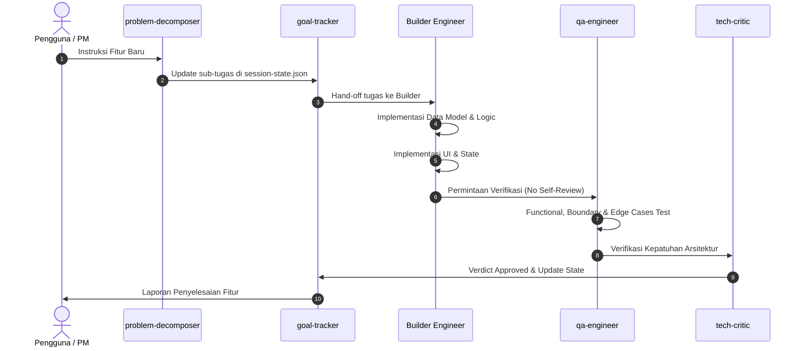

# Workflow: New Feature Lifecycle

> **Standard Operating Procedure**: Alur standar pengembangan fitur dari PRD hingga lolos verifikasi produksi.

---

## Alur Pengembangan Terstruktur:

---

## Langkah-demi-Langkah:

1. **Langkah 1: Klarifikasi & Dekomposisi Tugas**:
   - `problem-decomposer` memecah kebutuhan menjadi sub-tugas independen.
   - `goal-tracker` mendaftarkan sub-tugas ke `session-state.json`.
2. **Langkah 2: Definisi Kontrak & Skema Data**:
   - Definisikan tipe data atau skema sebelum menulis kode logika.
3. **Langkah 3: Implementasi Logika Bisnis (Backend / Services)**:
   - Terapkan guard clauses dan result pattern untuk menjaga stabilitas.
4. **Langkah 4: Integrasi Antarmuka (UI Components)**:
   - Hubungkan komponen UI dengan state dan service.
   - Pastikan micro-interactions halus dan layout responsif.
5. **Langkah 5: Pengujian & Review Independen (QA Gate)**:
   - Jalankan smoke test dan periksa error di console browser/terminal.
   - `qa-engineer` dan `tech-critic` memberikan vonis kelolosan.
6. **Langkah 6: Penyelesaian & Pemutakhiran State**:
   - `goal-tracker` menandai sub-tugas sebagai `done` di `session-state.json`.
