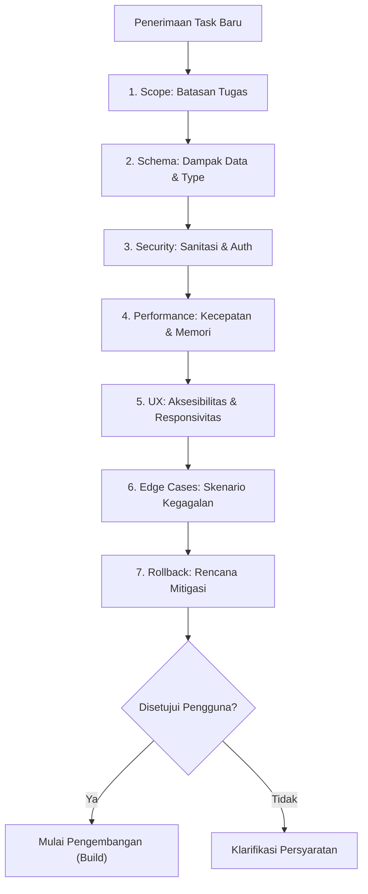

# Workflow: Task Review Protocol (Evaluasi 7 Pilar)

> **Mandatory Pre-Development Gate**: Setiap tugas baru atau perubahan fitur wajib melalui evaluasi 7 pilar ini sebelum penulisan kode dimulai.

---

## 7 Pilar Evaluasi Tugas:

1. **Scope (Cakupan Tugas)**:
   - Tentukan secara jelas file apa saja yang akan dibuat atau diubah.
   - Cegah refactoring liar pada modul lain yang tidak berhubungan.
2. **Schema (Dampak Skema Data / Tipe)**:
   - Identifikasi apakah ada perubahan field database, skema tipe data, atau struktur payload API.
3. **Security (Keamanan & Otorisasi)**:
   - Verifikasi otorisasi hak akses user/wallet.
   - Sanitasi input dan proteksi data sensitif.
4. **Performance (Kinerja & Sumber Daya)**:
   - Periksa potensi query lambat, memory leak, atau loop rekursif.
5. **UX & Accessibility (Pengalaman Pengguna)**:
   - Pastikan layout adaptif di layar desktop dan mobile.
   - Periksa kontras rasio warna (WCAG AA).
6. **Edge Cases (Penanganan Kasus Ekstrem)**:
   - Tangani skenario koneksi putus, saldo nol, input kosong, atau double click submission.
7. **Rollback Plan (Rencana Pembatalan)**:
   - Pastikan kode dapat dikembalikan dengan aman jika terjadi kegagalan saat implementasi.
