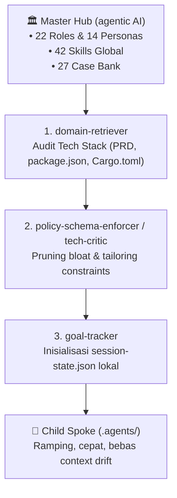

# Knowledge: Child Spoke Adoption & Customization Guide

> **Universal Spoke Provisioning Protocol**: Panduan resmi bagi agen dan pengembang untuk mereview, menyelaraskan, dan mengadopsi tata kelola `.agents` dari **Master Hub** (`agentic AI`) ke dalam repositori proyek anak (*Child Spokes*).

---

## 1. Filosofi & Tiga Peran Penyelaras (*Alignment Roles*)

Ketika sebuah proyek baru mengadopsi Master Hub, sistem tidak menyalin seluruh repositori secara mentah, melainkan diselaraskan oleh kolaborasi 3 peran orkestrasi:



1. **`domain-retriever` (Audit Stack & PRD)**: Membaca kebutuhan proyek dan menentukan arsitektur yang cocok.
2. **`policy-schema-enforcer` / `tech-critic` (Pruning & Tailoring)**: Menghilangkan file yang tidak relevan (zero bloat) dan memastikan aturan mutlak keamanan tetap aktif.
3. **`goal-tracker` (State Management)**: Mengunci `established_constraints` awal dan mencatat sub-tugas pertama di `session-state.json`.

---

## 2. Enam Komponen Wajib (.agents Core Essentials)

Setiap proyek anak yang mengadopsi Master Hub wajib memiliki 6 komponen inti berikut:

| No | Komponen | File Path | Fungsi Utama |
|---|---|---|---|
| 1 | **Session State** | `.agents/session-state.json` | Single source of truth, pencegah *context drift*, pengunci batasan teknis (*locked constraints*). |
| 2 | **Local Entry File** | `AGENTS.md` (root & `.agents/`) | Panduan otomatis saat workspace dibuka; menghubungkan ke PRD lokal dan peran aktif. |
| 3 | **Core Guardrails** | `.agents/rules/00-core-guardrails.md` | Larangan hardcode kredensial, kepatuhan arsitektur, dan prinsip No Self-Review. |
| 4 | **Workflow Discipline** | `.agents/rules/01-workflow-discipline.md` | Disiplin OODA loop, 7 pilar review gate, dan pembersihan zombie code. |
| 5 | **Domain Architecture** | `.agents/rules/10-domain-architecture.md` | Standar arsitektur teknis spesifik proyek (Web3, Laravel, Next.js). |
| 6 | **Standard Workflows** | `.agents/workflows/` | SOP evaluasi pra-coding (`task-review-protocol.md`) dan siklus fitur (`new-feature-lifecycle.md`). |

---

## 3. Otomasi Provisioning via CLI

Master Hub menyediakan skrip otomatis untuk menghasilkan starter pack `.agents` yang sudah disesuaikan:

```bash
# Perintah umum di repositori Master Hub:
npm run spoke:scaffold -- --target "<path-ke-proyek>" --name "<NamaProyek>" --type "<tipe>" --goal "<tujuan>"

# Contoh: Proyek Web3 Solana (SolanaTradeMemes)
npm run spoke:scaffold -- --target "c:\Users\ASUS\Documents\Web Dev\improving\SolanaTradeMemes" --name "SolanaTradeMemes" --type "web3-solana" --goal "Sistem Trading Memecoin Solana Terintegrasi Dexscreener & Phantom Wallet"

# Contoh: Proyek Laravel (adminShuttleV3)
npm run spoke:scaffold -- --target "c:\Users\ASUS\Documents\Web Dev\sunjaya\Roleback\adminShuttleV3" --name "adminShuttleV3" --type "laravel"

# Contoh: Proyek Next.js E-Commerce
npm run spoke:scaffold -- --target "c:\Users\ASUS\Documents\Web Dev\improving\E-Comerce-BucketFlowers" --name "E-Comerce-BucketFlowers" --type "nextjs"
```

---

## 4. Preset yang Tersedia

1. **`web3-solana`**:
   - Stack: Solana Web3.js, Anchor Framework, Next.js App Router, Tailwind CSS.
   - Roles: `smart-contract-engineer` & `frontend-engineer`.
   - Constraints: Larangan hardcode private key, RPC rate-limit fallback, Phantom auto-reconnect.
2. **`laravel`**:
   - Stack: Laravel 11 (4-Layer Controller -> Service -> Repository -> Model), MySQL/PostgreSQL.
   - Roles: `backend-engineer` & `laravel-architect`.
   - Constraints: Pemisahan ketat 4-layer, validasi via FormRequest, Spatie RBAC.
3. **`nextjs`**:
   - Stack: Next.js App Router (React 19), TypeScript, Tailwind CSS, Server Actions.
   - Roles: `frontend-engineer` & `fullstack-engineer`.
   - Constraints: Server Components default, dark-mode tokenized palette, WCAG AA.
4. **`general`**:
   - Stack: Fullstack Modern Web Application.

---

## 5. Sinkronisasi Dua Arah (Upstream Learning)

- Jika proyek anak menemukan bug unik di produksi dan menyelesaikannya secara elegan, catat di `.agents/knowledge/cases/`.
- Solusi yang memiliki nilai guna umum disetorkan (*upstream*) kembali ke Master Hub di `04-case-bank/cases/`.
